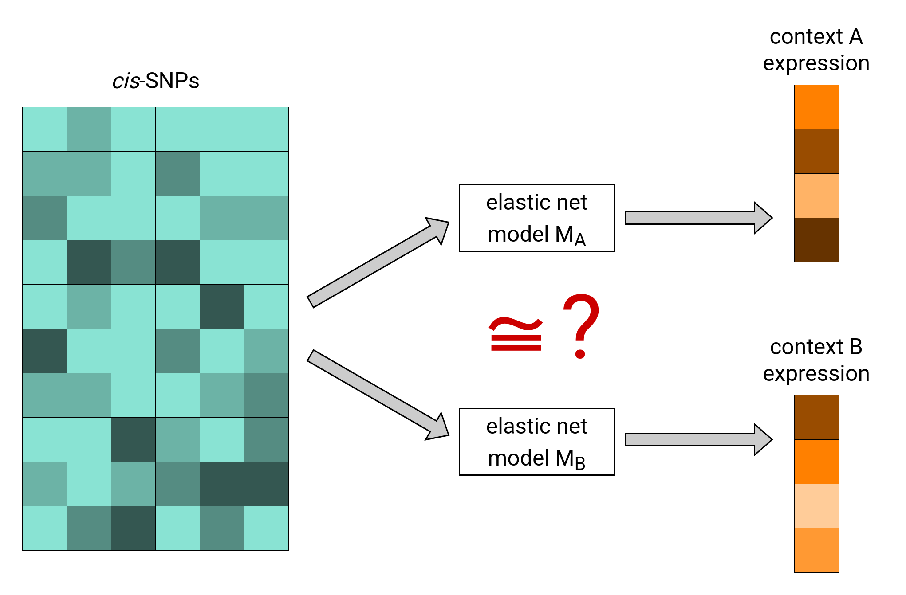
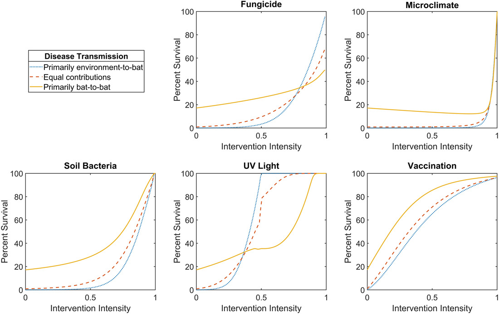

*My research interests span many applications of statistics in genetics and molecular biology, but I especially focus on studying the genetic basis of human diseases. By developing probabilistic and computational methods that synthesize genomic information with other omic data sets, I seek to uncover how genetic variability impacts disease pathways. My ultimate goal is to help solve the most pressing complex diseases, including cancer and dementia.*

### Discovering disease-associated loci

Genome-wide association studies (GWAS) scan the entire genome in search of genetic variants that are significantly associated with a given disease or trait. Typical GWAS only rely on genetic sequencing data, phenotype data, and common covariates such as age and sex. Recent technological advances, however, have made metabolomic, proteomic, and other omic data readily available as well. How can we improve the power of GWAS by making use of such data? What statistical considerations are involved? My PhD research is attempting to answer these questions.

### Understanding the role of gene regulation

Although every cell in your body contains exactly the same DNA sequences, the effects of any given gene may vary depending on how it is regulated. Thus, an understanding of the various genetic and epigenetic mechanisms that regulate gene expression is essential for a complete picture of the genomic architecture of human diseases. My research aims to elucidate these mechanisms and their roles in causing disease. Notably, I proposed and developed a method called [DRAB (Differential Regulation Analysis by Bootstrapping)](https://github.com/MykMal/drab) that can identify genes whose patterns of genetic regulation are significantly different between two tissues or other biological contexts.

I am also interested in transcriptome-wide association studies (TWAS), which aim to identify disease-causing genes by leveraging predictive models of genetic regulation. In a [recent paper](https://doi.org/10.1093/hmg/ddac015), my coauthors and I extended TWAS to account for nonlinear effects of gene expression and showed that our new method identifies genes missed by standard TWAS approaches.

### Managing infectious diseases

Before I stumbled across the fascinating field of statistical genetics, I researched infectious disease management from the perspective of mathematical epidemiology. For example, in [one project](https://doi.org/10.1186/s12889-021-11797-3) I worked with a team of mathematicians, economists, and ecologists to establish guidelines for transboundary infectious disease management when multiple administrative jurisdictions set different objectives. In [another project](https://doi.org/10.1111/nrm.12304) we demonstrated how to improve management outcomes for white-nose syndrome (WNS) in bats by considering metapopulation dynamics. Although this line of research is no longer my primary focus, I am still happy to consult and collaborate on related projects.

