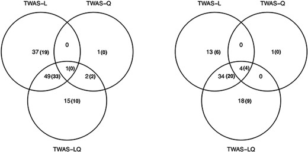

*My research interests span the many applications of statistics in genetics and molecular biology, but I especially focus on the genetic basis of human diseases. By developing probabilistic and computational methods that synthesize genomic information with other omic data sets, I seek to uncover how genetic variability impacts disease pathways. My ultimate goal is to solve the most pressing complex diseases, including cancer and dementia.*

### Gene regulation

Although an individual's genetic information remains constant throughout their lifetime, the effects of any given gene may vary depending on how it is regulated. Thus, an understanding of the various genetic and epigenetic mechanisms that regulate gene expression is essential for a complete picture of the genomic architecture of human diseases. My research aims to elucidate these mechanisms and their interactions. For example, I am currently developing a method called [DREX (Differential Regulation of EXpression)](https://github.com/MykMal/drex) which will identify genes that have tissue-specific patterns of regulation.

### Causal inference for genomics

Genome-wide association studies (GWAS) can successfully identify the genetic variants that are significantly associated with any phenotype, but knowing such variant-trait associations alone rarely leads to breakthroughs in translational research. My work aims to move beyond merely establishing correlations: I want to understand how and to what extent genetic mutations actually *cause* complex diseases. To this end I am working on causal inference frameworks for functional genomics, for which I draw inspiration from instrumental variables regression and expression quantitative trait loci (eQTL) studies. For example, I [recently showed](https://doi.org/10.1093/hmg/ddac015) that we can identify a greater number of putatively causal genes in transcriptome-wide association studies (TWAS) by accounting for nonlinear effects of gene expression.

### Infectious disease management

Before I discovered my passion for statistical genetics, I researched infectious disease management from the perspective of mathematical epidemiology. For example, in [one project](https://doi.org/10.1186/s12889-021-11797-3) I established guidelines for transboundary infectious disease management when multiple administrative jurisdictions set different objectives. In [another project](https://doi.org/10.1111/nrm.12304) I demonstrated how to improve management outcomes for white-nose syndrome (WNS) in bats by considering metapopulation dynamics. Although this line of research is no longer my primary focus, I am still happy to consult and collaborate on related projects.

