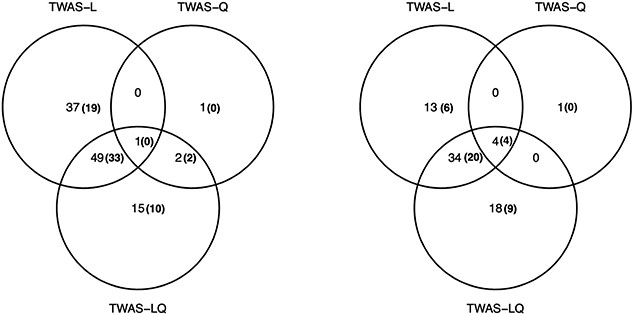
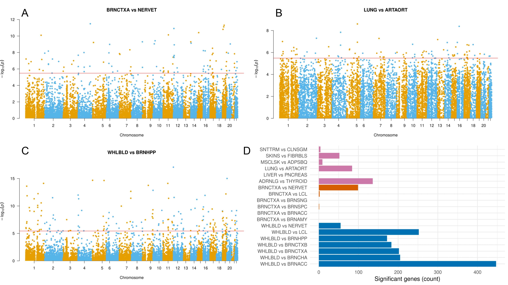
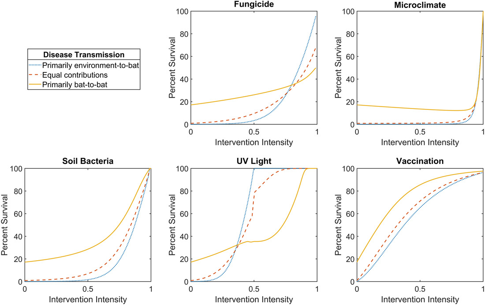

*My research interests span many applications of statistics in genetics and molecular biology, but I especially focus on studying the genetic basis of human diseases. By developing statistical and machine learning methods that synthesize genomic information with other omic data sets, I seek to uncover how genetic variability impacts disease pathways. My ultimate goal is to help solve the most pressing complex diseases, including cancer and dementia.*

### Discovering disease-associated variants and genes

Genome-wide association studies (GWAS) scan the entire genome in search of genetic variants, namely single-nucleotide polymorphisms (SNPs), that are significantly associated with a given disease or trait. Typical GWAS only rely on genetic sequencing data, disease phenotype data, and common covariates such as age and sex. Recent technological advances, however, have made metabolomic, proteomic, and other omic data readily available as well. I am currently working on methods that could improve the power of GWAS by making use of such data.

I am also interested in transcriptome-wide association studies (TWAS). The TWAS framework aims to prioritize disease-relevant genes by testing for association between disease status and genetically regulated gene expression levels. In a [recent paper](https://doi.org/10.1093/hmg/ddac015), my coauthors and I extended TWAS to account for nonlinear effects of gene expression on traits and showed that our new method identifies genes missed by standard TWAS approaches.

### Unraveling the genetic architecture of gene expression

Although every cell in your body contains exactly the same DNA sequences, the functions of genes may vary between cells and tissues depending on how the genes are regulated. Thus, an understanding of the various genetic and epigenetic mechanisms that regulate gene expression is essential for a complete picture of the pathways that give rise to complex traits. My research aims to elucidate these mechanisms and build better models for predicting expression levels. Notably, I proposed and developed a statistical method called [DRAB (Differential Regulation Analysis by Bootstrapping)](https://doi.org/10.1101/2023.03.06.531446) that can identify genes whose patterns of genetic regulation are significantly different between two tissues or other biological contexts. Now I am working on using ensemble learning techniques to develop more accurate models of transcriptional regulation, with the aim of robust prediction across ancestries and tissues.

### Managing emerging infectious diseases

Before I stumbled across the fascinating field of statistical genetics, I researched infectious disease management from the perspective of mathematical epidemiology. For example, in [one project](https://doi.org/10.1186/s12889-021-11797-3) I worked with a team of mathematicians, economists, and ecologists to establish guidelines for transboundary infectious disease management when multiple administrative jurisdictions set different objectives. In [another project](https://doi.org/10.1111/nrm.12304) we demonstrated how to improve management outcomes for white-nose syndrome (WNS) in bats by considering metapopulation dynamics. Although this line of research is no longer my primary focus, I am still happy to consult and collaborate on related projects.

